# GCS

## Description

GCS is `GIS Map data collector App` that help surveyors to collect, review, compare, and update data according to ground.

## Features:
- Add/update or delete (point, Polyline and Polygon).
- Fetch online GIS Map.
- Save geo database offline (FeatureTable, Layers .. etc).
- Offline Mode: `Load Raster files and merge them with their feature layers.
- Map Key.
- Dynamic indexing labels.
- Bookmarks.
- measurement tools (distance measurement).

## Libraries and Tools
- ESRI Android Map SDK
- Interface and Callbacks
- Threading
- GPS
- Third Party Libraries.
- Read & Write External Storage.

## Screenshots

  <br>
  <br>
 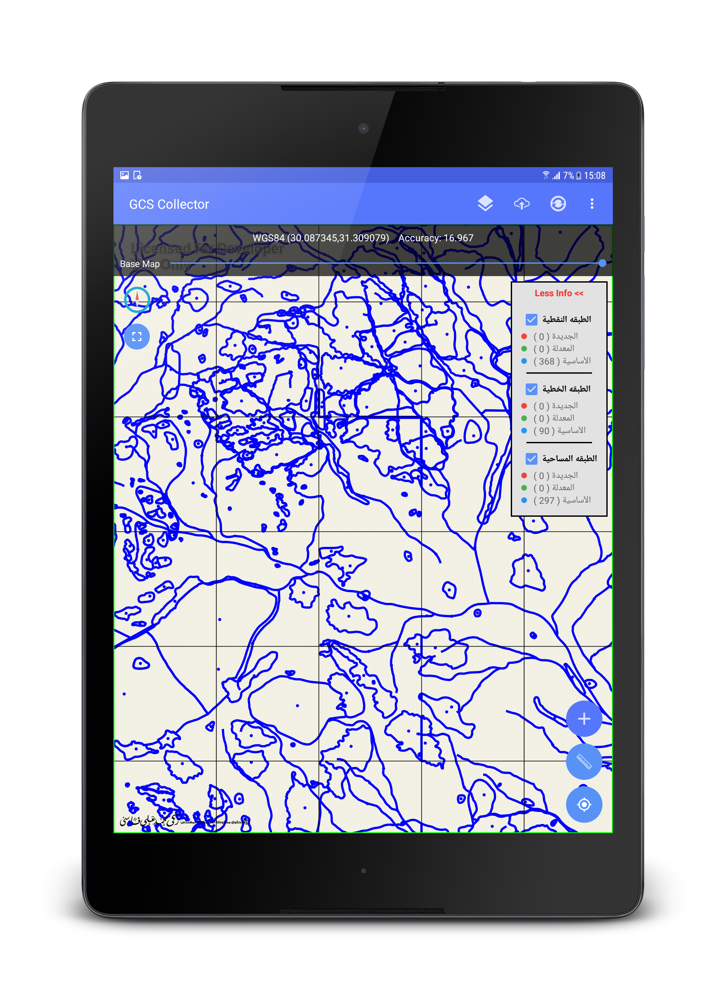 <br>
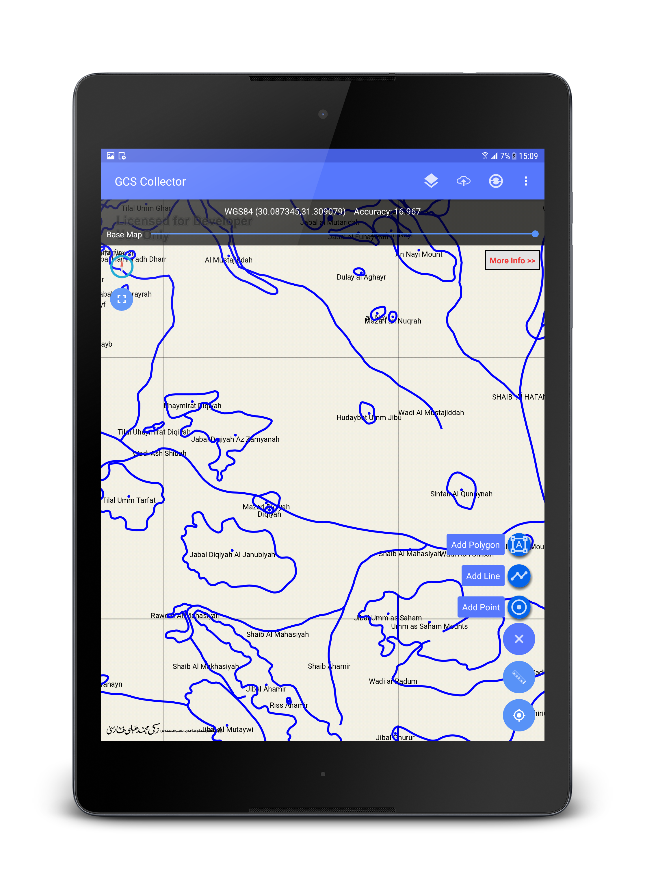 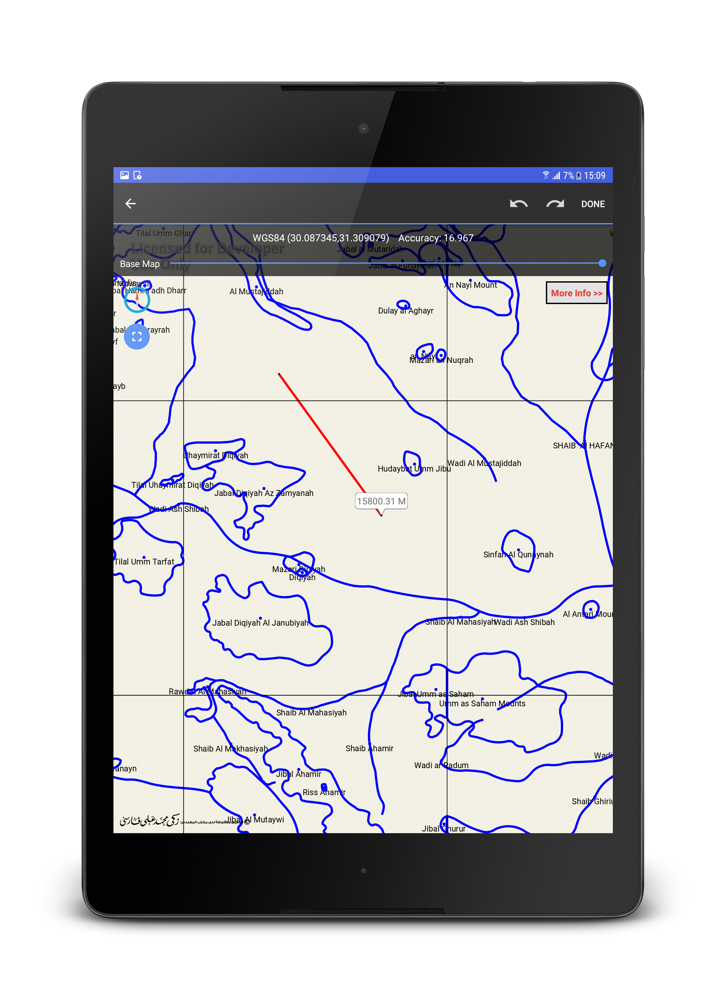 <br>
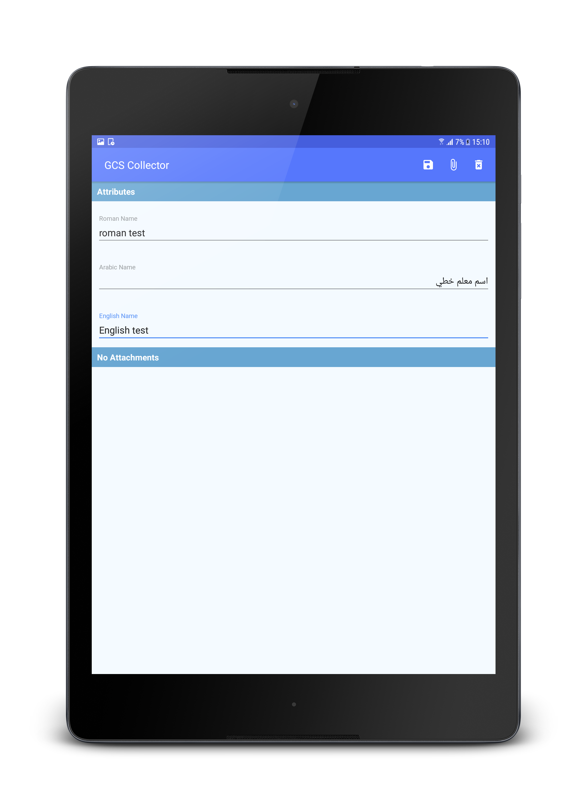 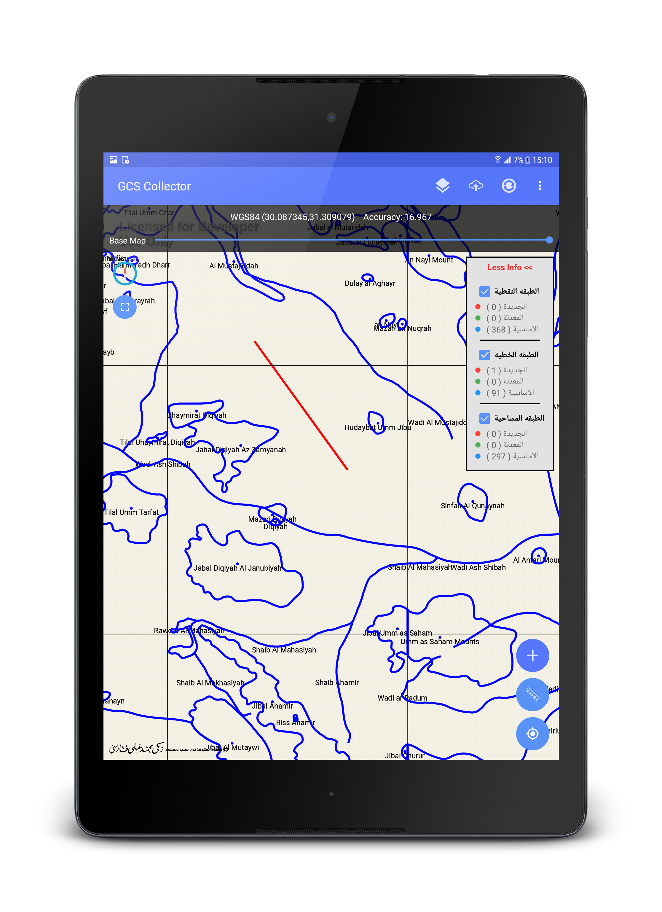 <br>
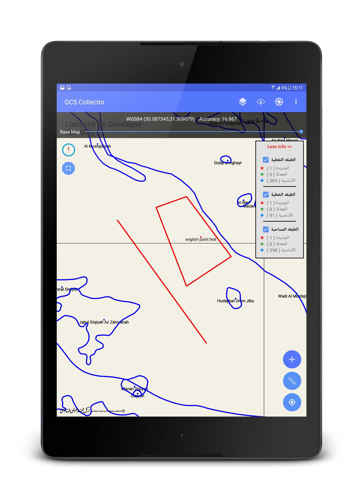 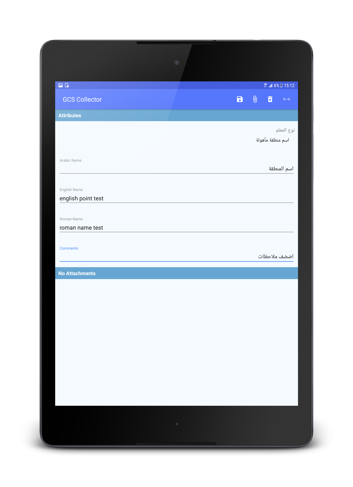 <br>
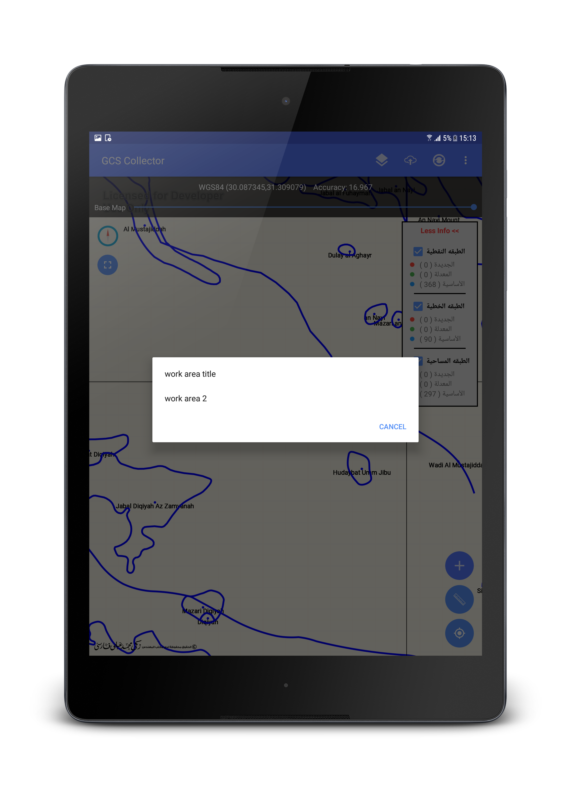 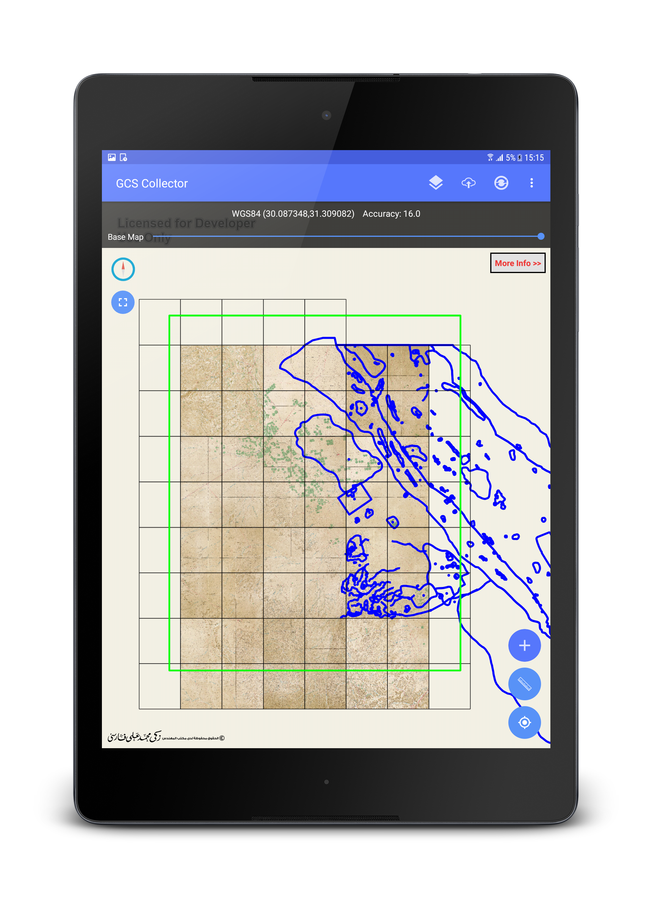 <br>
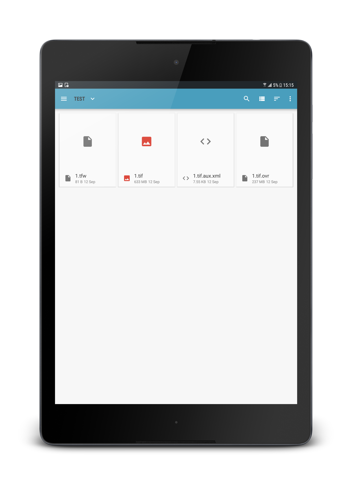 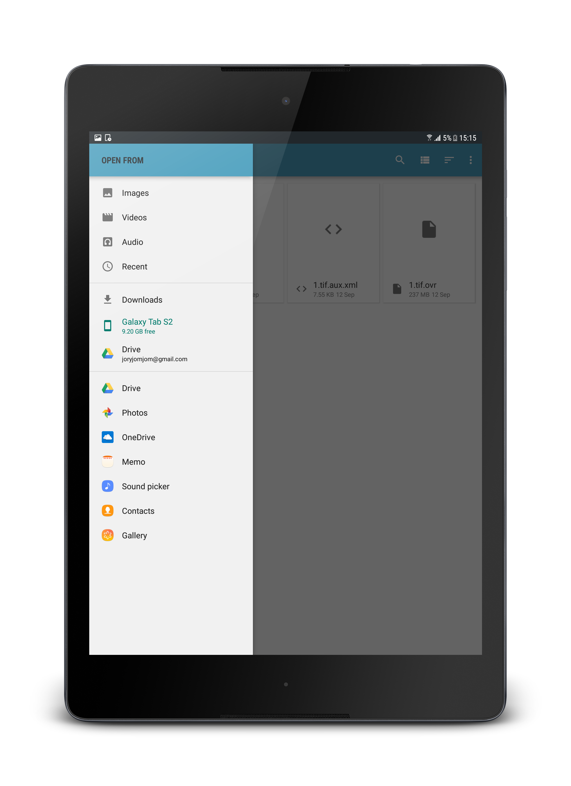 <br>
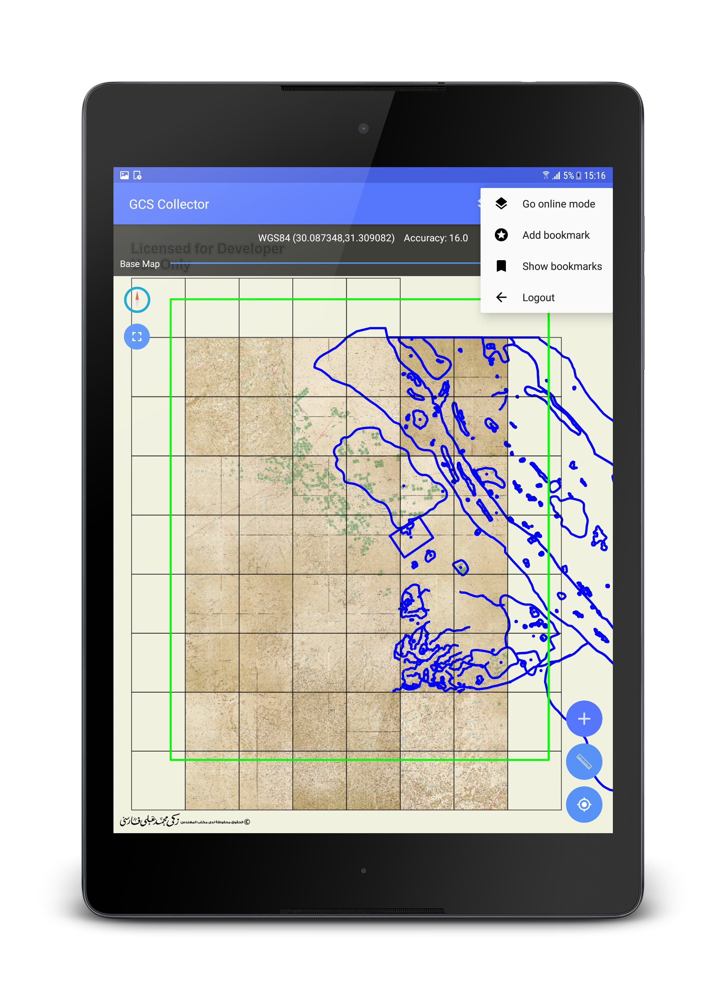  <br>

## License

* [Apache Version 2.0](http://www.apache.org/licenses/LICENSE-2.0.html)

```
Copyright 2018 Ali Ussama

Licensed under the Apache License, Version 2.0 (the "License");
you may not use this file except in compliance with the License.
You may obtain a copy of the License at

 http://www.apache.org/licenses/LICENSE-2.0

Unless required by applicable law or agreed to in writing, software
distributed under the License is distributed on an "AS IS" BASIS,
WITHOUT WARRANTIES OR CONDITIONS OF ANY KIND, either express or implied.
See the License for the specific language governing permissions and
limitations under the License.
```
